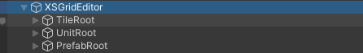

# XSGridEditor

XSGridEditor是插件的重要组成部分, 在这里作为演示的范例场景是Scenes/Demo_1.unity. 如图所示, 我们可以在范例场景中找到这个节点.

## XSGridEditor

提供了一些编辑tile时的常用功能.

## TileRoot

用XSGridEditorBrush添加的tile都放在这个节点下. 你可以通过调整节点上脚本Grid的CellSize改变tile的大小.

## UnitRoot

用XSUnitNodeBrush添加的Unit都放在这个节点下.

## PrefabRoot

用XSPrefabNodeBrush添加的对象默认放在这个节点下, 你也可以通过XSPrefabNodeBrush的配置改成其他节点, 并没有限制.

## main

挂载了测试场景用的脚本XSBattleMgr, 用于演示如何显示移动范围, unit移动.
